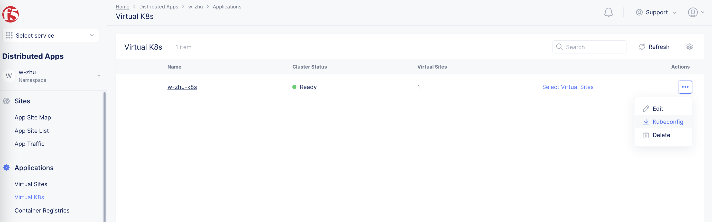
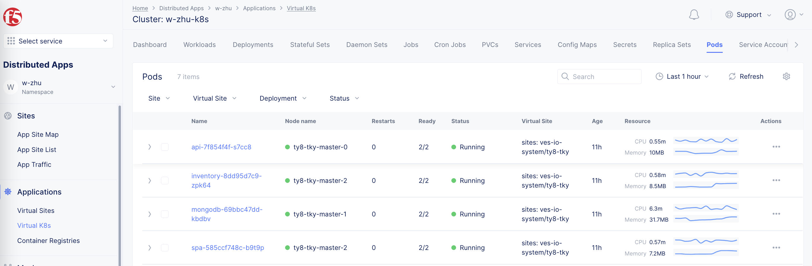
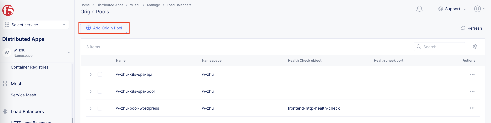
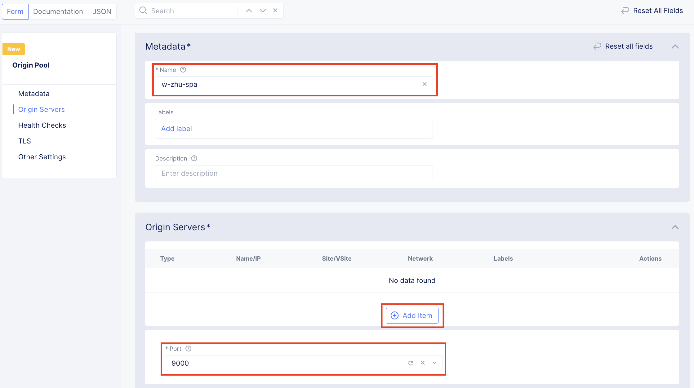
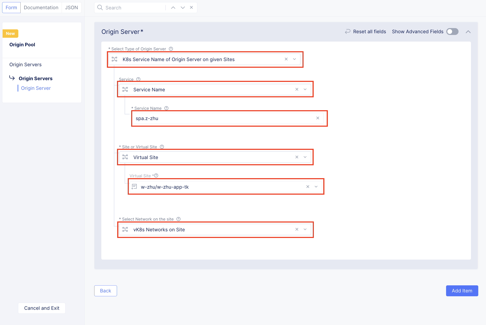
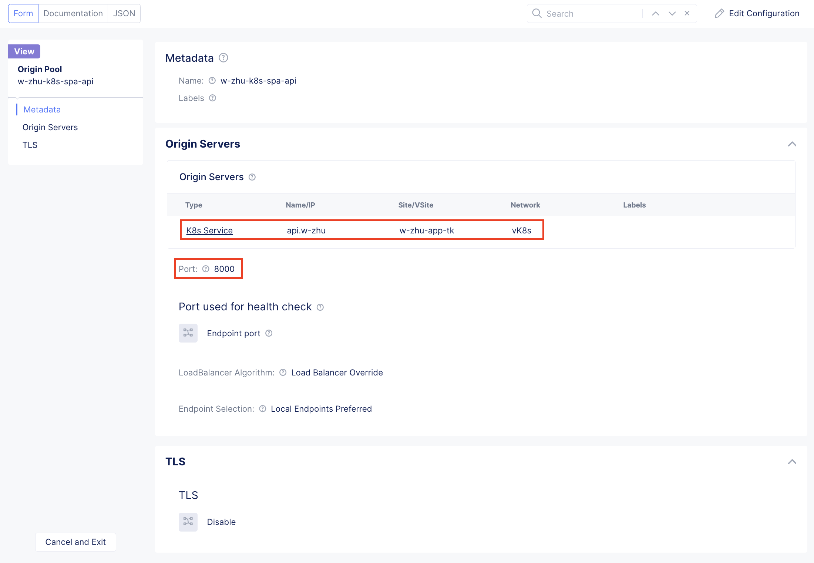
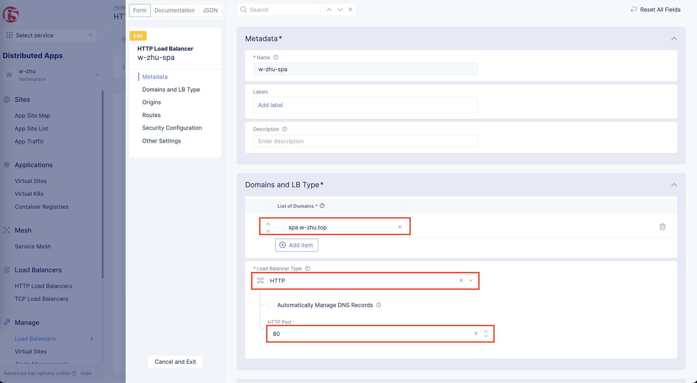
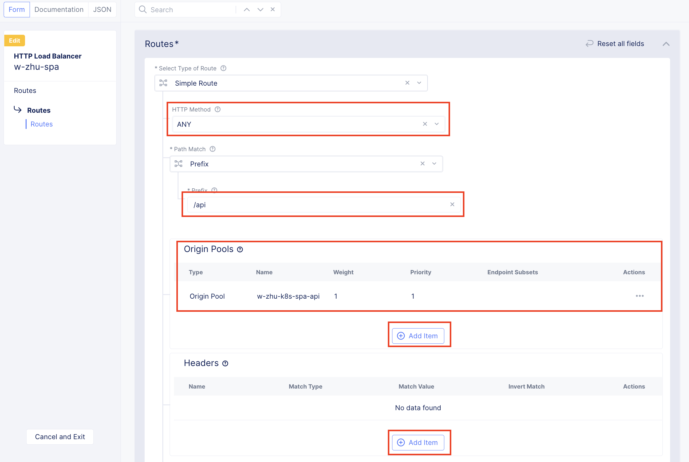
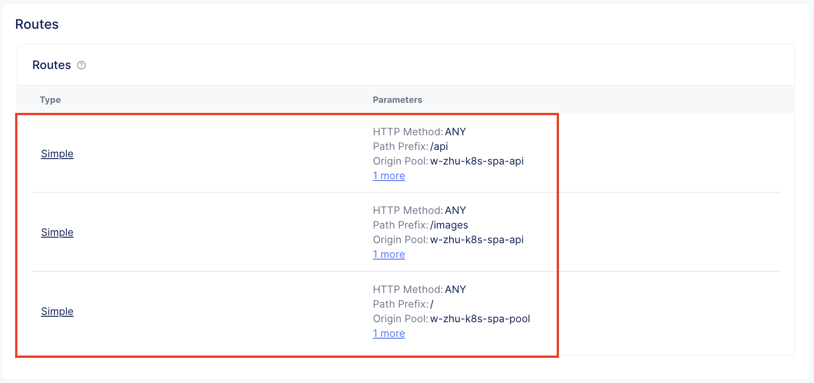
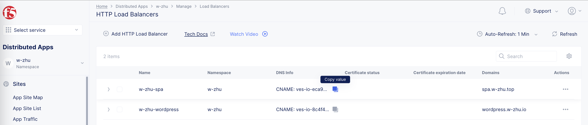

# Single-Page Application Demo 
This application demos a modern single-page application built on:
- Vue.js (front-end)
- Node.js (back-end)
- MongoDB (database)

This application was created to help train people on the [F5 Distributed Cloud Services](https://www.f5.com/cloud) capabilities. 


# Components
### Frontend
Vue.JS application that simulates a shopping cart application.

- Environment: Internet facing 

### API
Node.JS application running on Express.JS that provides the primary API and access to the database. 

- Environment: Internet facing

### Database
MongoDB database that stores information about the user and the products.  This database is seeded with user and product data on launch. 

- Environment: Internal 

### Recommendations
Node.JS microservice that will recommend products.

- Environment: Internet facing 

### Inventory
Node.JS microservice that will tell the local store inventory.  Note, this microservice is accessed through the API and simulates the API server talking to an internal service. 

- Environment: Internal, accessibly by the API server

# Features
### Stats Page
The stats page provides information for the various components that make up this application:
- service URL
- Latency
- Historic latency graph


NOTE: If a component is offline, a component card such as in the image above will turn red.

### Product Detail
The Product detail page contains the recommendations and inventory microservices. 


# Setup Env

<b> >>> Download kubeconfig file from XC to your workspace <<< </b>



```
export KUBECONFIG=$(pwd)/vk8s-manifest.yaml
```

# Deploy 

```
kubectl apply -f api.yaml
kubectl apply -f inventory.yaml
kubectl apply -f mongodb.yaml
kubectl apply -f recommendations.yaml
kubectl apply -f spa.yaml
```

<b> >>> Check the components status <<< </b>



# Config Load Balance & Ingress

<b> >>> Add Source pool for Frontend <<< </b>







<b> >>> Same way to add Source pool for Backend <<< </b>



<b> >>> Load Balance Setup <<< </b>



<b> >>> Add Routes: <<< </b>



<b> >>> There are 3 path for this website <<< </b>



# Check your application via DNS name from "DNS Info"


# Attribution
This code is based on the work of [Shaun Wassell](https://www.linkedin.com/in/shaun-wassell?trk=lil_course&lipi=urn%3Ali%3Apage%3Ad_learning_content%3BEJRJvvk4SzmhYz%2Bf1ZJBUw%3D%3D&licu=urn%3Ali%3Acontrol%3Ad_learning_content-view_on_linkedin) and his [Creating and Hosting a Full-Stack Site LinkedIn Learning course](https://www.linkedin.com/learning/vue-js-creating-and-hosting-a-full-stack-site/).

I have extended his demo to:
- run components in F5 Disctribute Cloud
- abstract API and image URLs 
- seed MongoDB 
- recommendations microservice
- store inventory simulation  
- stats page for all services
